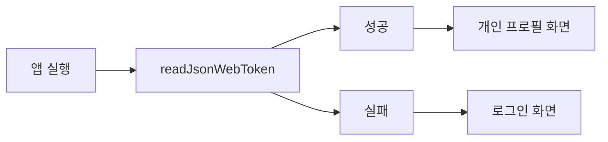
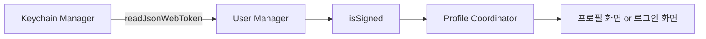
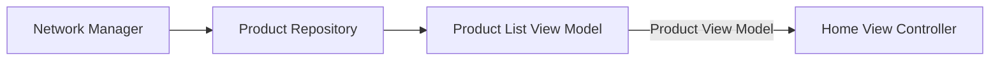

## 🧀 프로젝트 요약
* 중고 거래 플랫폼 서비스
* iOS팀은 dev-iOS 브랜치에서 작업

## 🧀 개발 내용
* 로그인
* 상품 목록 보기

### 🔐 로그인
`GitHub OAuth 2.0`을 활용해 로그인 기능 구현
#### 사용자 흐름
1. 'GitHub로 로그인' 버튼 터치
2. Safari에서 GitHub 로그인 및 Authorize 버튼 터치
3. 이메일을 입력하고 완료 버튼 터치

#### 스크린샷
<p align="center">
  
  
  
  
  
</p>

#### 목표
로그인 정보(Json Web Token)를 처리하기  
  - 로그인 정보 저장하기
  - 로그인 상태에 따라 뷰 업데이트하기
  - 유저가 앱을 다시 실행했을 때, 다시 로그인 할 필요없이 저장된 로그인 정보를 확인하고 로그인 해주기
#### 구현 방법
- 로그인 정보(JWT)를 키체인에 저장
- 로그인 상태를 관리하는 객체를 통해 뷰 업데이트하기
  - 로그인하면 뷰 업데이트   
  - 로그아웃 버튼 터치시 뷰 업데이트
- 앱을 실행하면 JWT 저장유무에 따라 로그인 상태를 판별해서 뷰를 업데이트하기

`Keychain Manager`가 키체인 읽기, 저장, 삭제의 책임을 갖도록 추가
```swift
class KeychainManager: KeychainManageable {

    func addJsonWebToken(_ jwt: JWT, email: String) async throws {
        let accessToken = jwt.accessToken
        let refreshToken = jwt.refreshToken
        let token = accessToken + "*" + refreshToken
        let attrs: [String: Any] = [
            kSecClass as String: kSecClassGenericPassword,
            kSecAttrAccount as String: email,
            kSecAttrService as String: self.appName,
            kSecValueData as String: token.data(using: .utf8) as Any,
        ]
        
        let status = SecItemAdd(attrs as CFDictionary, nil)
        
        if status != errSecSuccess {
            throw KeychainManagerError.failedToAddJsonWebToken
        }
    }
    
    func readJsonWebToken() async throws -> JWT {
        let query: [String: Any] = [
            kSecClass as String: kSecClassGenericPassword,
            kSecAttrService as String: self.appName,
            kSecReturnAttributes as String: true, // item이 nil이 되지 않고 확인 가능
            kSecReturnData as String: true // data로 저장한 token 출력 가능
        ]
        
        var result: AnyObject?
        let status = SecItemCopyMatching(query as CFDictionary, &result)
        
        if status != errSecSuccess {
            throw KeychainManagerError.failedToReadJsonWebToken
        } else {
            if let attributes = result as? NSDictionary,
               let tokenData = attributes[kSecValueData] as? Data,
               let tokenString = String(data: tokenData, encoding: .utf8) {
                let tokens = tokenString.components(separatedBy: "*")
                let jwt = JWT(accessToken: tokens[0], refreshToken: tokens[1])
                return jwt
            } else {
                throw KeychainManagerError.failedToTypeCast
            }
        }
    }
    
    func deleteJsonWebToken() async throws {
        // ...
    }
}
```
`User Manager`가 로그인 상태를 관리하도록 추가
```swift
class UserManager {
    static let shared = UserManager()
    @Published var isSignedIn = false
    @Published var userInfo: UserInfo?
}
```
**앱 실행시 다음 과정을 거쳐 로그인처리**


### 📦 상품 목록 보기
#### 스크린샷
<p align="center">
  
</p>

#### 구현 방법
다음 아키텍처를 통해 데이터 처리

**ProductListViewModel**
* 홈 화면 뷰 모델
* 개별 상품 데이터를 셀에 사용할 뷰 모델로 변환

```swift
class ProductListViewModel: ProductListRepresentable {
    private var productRepository: ProductRepository
    @Published var productViewModels: [ProductViewModel] = []
    //...

    init(productRepository: ProductRepository, pastTimeCalculator: PastTimeCalculable) {        
        //...

        self.productRepository.$products
            .sink { newProducts in
                let productViewModels = self.convertProductToProductViewModel(newProducts)
                self.productViewModels = productViewModels
            }
            .store(in: &subscriptions)
    }
    
    /// DTO이자 모델에 해당하는 Product를 ViewModel로 변경하는 메소드
    private func convertProductToProductViewModel(_ products: [Product]) -> [ProductViewModel] {
        
        return products.map { product in ProductViewModel(product: product, pastTimeCalculator: self.pastTimeCalculator) }
    }
}
```

### [노션] 상세내용
* [로그인 기능](https://www.notion.so/hoonding/525a5875eafe4e9c871aa0aebcfe34fe?pvs=4)
* [상품 데이터 가져오기](https://www.notion.so/hoonding/469e4a5c066646ed97fb5ca6cc2f3117?pvs=4)

## 👪 멤버 소개

|  |  |  |  |  |  |
| :-----------------------------------------------------------: | :------------------------------------------------------------: | :----------------------------------------------------------------: | :-----------------------------------------------------------: | :-----------------------------------------------------------: | :-----------------------------------------------------------: |
|        [**제이든(FE)**](https://github.com/JaydenLee1116)         |           [**훈딩(FE)**](https://github.com/hoongding)           |         [**코어(BE)**](https://github.com/meena2003)         |        [**감자(BE)**](https://github.com/leegyeongwhan)         |        [**에디(iOS)**](https://github.com/raindropiOS)         |        [**하림(iOS)**](https://github.com/harimrim)         |

## 🧾 기술 스택


